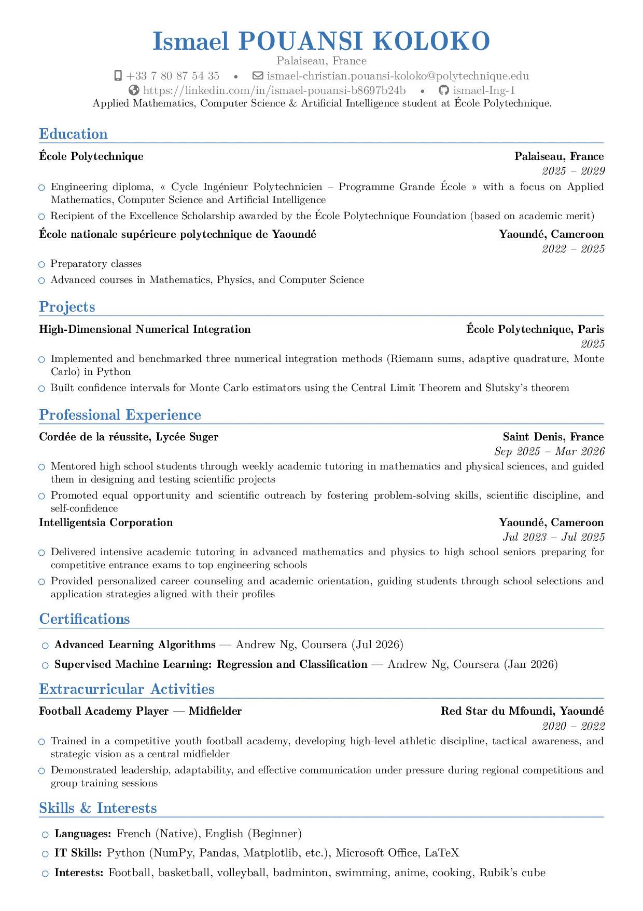

# CV - POUANSI Ismael

[](https://github.com/ismael-Ing-1/cv/actions/workflows/build-pdf.yml)

Academic and professional résumé — **moderncv** banking style, blue theme, built with pdflatex.

---

## Preview

> _Preview is auto-generated by CI on each push to `master`._



---

## Stack

| Component | Choice |
|-----------|--------|
| Document class | `moderncv` (banking style) |
| Color theme | blue |
| Font | TeX Gyre Pagella (`tgpagella`) |
| Compiler | **pdflatex** |

> **Engine note:** moderncv banking uses `tgpagella.sty` (pdflatex font package).
> Use `pdflatex` for correct bold, color, and TeX Gyre Pagella rendering.
> XeLaTeX causes font conflicts with banking's pdflatex font loader.

---

## Build locally

### Prerequisites

```bash
# Ubuntu / Debian — full texlive (recommended)
sudo apt-get install texlive-full

# Minimal
sudo apt-get install texlive-latex-extra texlive-fonts-extra

# For make check (page count)
sudo apt-get install poppler-utils
```

### Makefile (recommended)

```bash
make build     # compile — always rebuilds (no timestamp check), double pass, PDF copied to root
make check     # dashes first (no build on failure), then build, then 1-page gate
make preview   # generate preview.png from the compiled PDF (requires imagemagick)
make push      # check, then sync with GitHub (fetch+merge), then push to both remotes
make push-tags # push + push all tags → triggers GitHub Release with PDF
```

### Manual (pdflatex)

```bash
mkdir -p build
pdflatex -interaction=nonstopmode -output-directory=build CV_POUANSI_Ismael.tex
pdflatex -interaction=nonstopmode -output-directory=build CV_POUANSI_Ismael.tex
cp build/CV_POUANSI_Ismael.pdf .
```

Output: `CV_POUANSI_Ismael.pdf` at the project root — ready to share directly.

> Always use **pdflatex** — moderncv banking loads `tgpagella.sty` (a pdflatex font package).
> XeLaTeX causes font conflicts leading to bold and color rendering failures.

---

## CI/CD

Pipeline triggers on every push to `master`:

| Platform | Config | Artifacts |
|----------|--------|-----------|
| **GitHub Actions** | `.github/workflows/build-pdf.yml` | `CV_POUANSI_Ismael.pdf` (90 days) · `preview.png` committed to repo |

On **tagged releases** (`git tag -a 2026-09-05 -m "2026-09-05" && git push origin --tags`), a GitHub Release is created with the PDF attached.

---

## Structure

```
cv/
├── CV_POUANSI_Ismael.tex          # LaTeX source (single file)
├── preview.png                    # auto-generated by CI, committed to repo
├── Makefile                       # make build / check / preview / push
├── scripts/
│   └── check-dashes.sh            # fail if any tracked .tex has --- (runs first in make check)
├── README.md
├── CHANGELOG.md
├── TODO.md
├── .gitignore
├── .github/
│   └── workflows/
│       └── build-pdf.yml          # GitHub Actions pipeline
└── build/                         # LaTeX intermediates — git-ignored
    ├── CV_POUANSI_Ismael.aux
    ├── CV_POUANSI_Ismael.log
    ├── CV_POUANSI_Ismael.out
    └── CV_POUANSI_Ismael.pdf      # copied to root by make (root PDF also git-ignored)
```

---

## Repos

- **GitHub:** [ismael-Ing-1/cv](https://github.com/ismael-Ing-1/cv)
